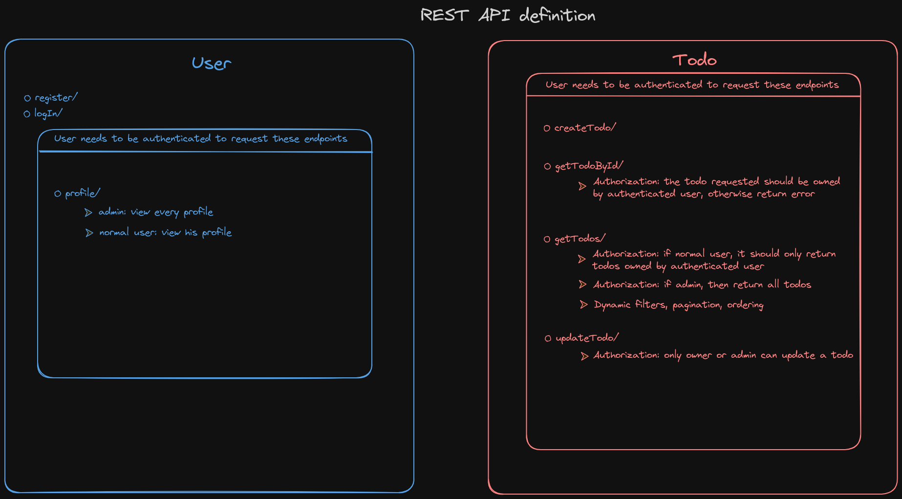

# sf-pocs

A comparison between different frameworks on how to implement basic backend todo app, with functionalities such as authentication, authorization, filtering, pagination and ordering.
All projects are using a RESTful approach, some provide also Swagger UI and OpenApi definition, depending on the framework availability.

## Add submodules
To add submodules to project: git submodule update --init --recursive

## Update submodules
To update all submodules to latest commit: git submodule update --remote
